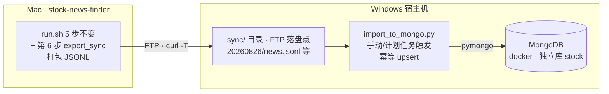

# Mongo 数据模型与同步设计

> 版本：v1.0（2026-08-26）
> 链路：**FTP 中转批量同步**（Mac 采集 → FTP → Windows 导入 Mongo）
> 原则：**文件仍为第一事实源**（raw/ daily/ 不变），DB 为查询/回测层；同步幂等可重跑

## 1. 同步架构



- 连接串（Windows 侧）：`mongodb://root:<pwd>@localhost:27017/stock?authSource=admin`
  （不用 docker 服务名 `mongo`；不写进 fastgpt 库）
- 幂等：所有写入按业务键 upsert，重复导入无副作用

## 2. Collection 模型（6 个）

### news（新闻底稿，查询/回测入口）
```javascript
{ news_id, title, title_hash(md5去重键), body,
  time: ISODate, trade_date: "YYYY-MM-DD",     // trade_date 由 time 截取冗余
  source: "eastmoney-fast", source_name: "东方财富",
  url, stocks: [官方标注代码], tag: 搜索源主题标签, media,
  created_at: ISODate }
索引: {news_id:1} unique sparse / {title_hash:1} unique /
      {trade_date:1, source:1} / {stocks:1} / {time:-1}
```

### signals（每日信号，回测核心表）
```javascript
{ trade_date, code, name, rank, score, pos, neg,
  events: [事件类型...],
  hits: [ { time: "HH:MM", event, reason, title, url, source,
            channel: "官方标注|文本匹配|产品传导:词" } ],   // 内嵌明细
  generated_at }
索引: {trade_date:1, code:1} unique / {trade_date:1, score:-1}
```

### llm_events（LLM 分类结果）
```javascript
{ _id: "<date>:<序号>", trade_date, stocks, event, impact, confidence, reason }
索引: {trade_date:1, event:1}
```

### stocks（公司词典库化）
```javascript
{ code, name, aliases: [], origin: "manual|excel|sz|lookup", updated_at }
索引: {code:1} unique
```

### boards（板块成分按日版本化——优于 board_cache.json 仅当日）
```javascript
{ word, board_code, board_name, date: "YYYY-MM-DD",
  constituents: [{code, name}], count }
索引: {word:1, date:-1}
// 回测可查「信号当日成分」而非今日成分，规避部分视角偏差（R8）
```

### runs（运行/导入审计）
```javascript
{ ts, host, type: "export|import", date, counts: {...} }
```

## 3. 数据流与文件契约

export_sync.py 打包 `sync/<yyyymmdd>/`：

| 文件 | 来源 | 目标 collection |
|---|---|---|
| news.jsonl | raw/<date>.json | news |
| signals.jsonl | output/signals_<date>.json（match_score 顺产） | signals |
| llm_events.jsonl | output/llm_events.json（标记当日） | llm_events |
| stocks.jsonl | data/stock_dict.json | stocks |
| boards.jsonl | data/board_cache.json（标记当日） | boards |
| manifest.json | 计数清单 | runs |

## 4. 数据量预估

news ~800 条/日（~0.4MB）、signals ~700 条/日（~0.2MB）→ 年 ~220MB，单机无压力，不设 TTL，全部永久保留。

## 5. 配置

- FTP：`data/ftp.json`（url/user/pass/remote_dir），未配置时只打包不上传
- Mongo：Windows 侧环境变量 `MONGODB_URI`（或 import 脚本 --uri 参数）
