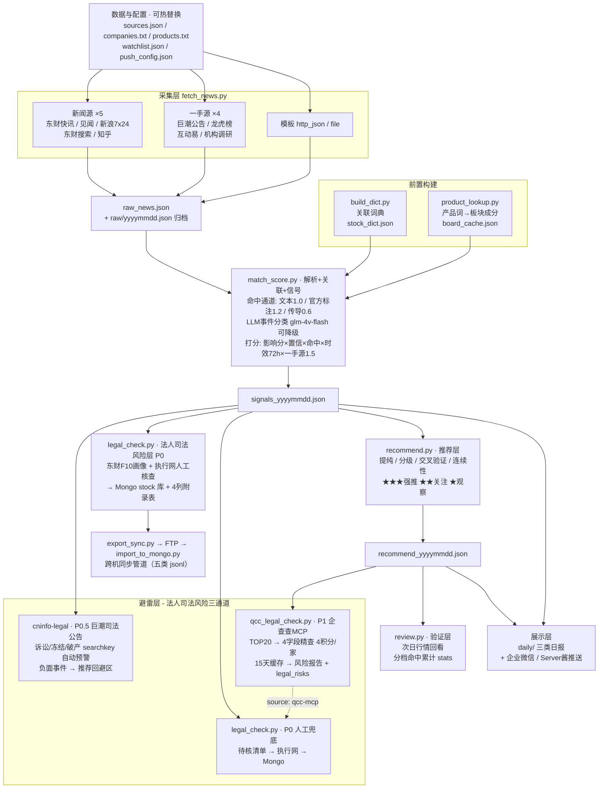

# 股票新闻分析系统 · 概要设计

> 版本：v1.5（2026-09-15，对应需求文档 v0.8 + 3.8 节）
> 路径约定：脚本均位于 `scripts/`（本文模块名省略此前缀，如 fetch_news.py 即 scripts/fetch_news.py）
> 定位：信息驱动的选股研究漏斗（非交易系统）
> **文档即事实源**：凭本文 + 需求文档可重建全部脚本与运行环境（含目录、接口、表模型）

## 1. 系统概览



## 2. 模块设计

### 2.1 采集层（插件化，9 源）

**设计原则**：一源一模块，接口统一，动态加载。新增源零侵入。

| 组件 | 职责 |
|---|---|
| `fetchers/SPEC.md` | 插件接口规范：`fetch(cfg)→[news]`（6 固定字段）+ `selftest()→bool` |
| 新闻源 ×5 | 东财快讯（游标翻页/全天/回补/stockList）、华尔街见闻、**新浪7x24**（替代财联社，D21）、东财关键词搜索（宏观/地缘，三层过滤）、知乎 pins |
| **一手源 ×4** | **巨潮公告**（watchlist 全量+全市场高价值类别关键词过滤，官方代码+PDF直链）、**龙虎榜**（净买方向+机构参与入标题，榜后1/5/10日涨幅入body）、**互动易**（董秘回复+强信号词滤，边界回看3天）、**机构调研**（≥3家机构、同股同日去重保最大、高管接待打标） |
| 模板 ×2 | http_json（通用 JSON 接口）、file（本地调试） |
| `fetch_news.py` | loader：读 sources.json → 动态 import → 汇总去重 → 输出 + 按日归档 |
| `sources.json` | 源配置（enabled 开关、私有参数） |

**一手源公共设计**（v0.8）：官方标注 stocks 字段 + body 内嵌「名称（代码）」模式（供词典外名称提取）；事件权重 ×1.5 权威加成（D18）。

**数据流**：`fetch(cfg)` → 全量当日新闻（`_stop_date` 注入日期边界）→ 标题去重 → `output/raw_news.json`（当日工作区）+ `raw/yyyymmdd.json`（历史归档，增量合并，以旧归档为去重基准）

**新闻记录契约**（全系统统一）：

```json
{"title": "...", "body": "...", "time": "YYYY-MM-DD HH:MM:SS",
 "source": "<type>", "url": "...", "stocks": ["601827"]}
```

### 2.2 关联层（三通道命中）

| 通道 | 权重 | 数据源 | 说明 |
|---|---|---|---|
| 文本匹配 | 1.0 | companies.txt（4500 只全 A 股 + 别名） | 名称+别名子串匹配，长词优先 |
| 官方标注 | 1.2 | 东财 stockList / 巨潮 secCode / 龙虎榜 SECURITY_CODE | **词典外代码也收录**（A股代码段白名单 60/68/00/30，排除 ETF/北交所，D22），名称从 body「名称（代码）」自动提取 |
| 产品传导 | 0.6 | products.txt → 板块成分股 | 产品词命中新闻 → 关联板块内词典股票（推荐层单列为联动池，D19） |

词典维护四入口：手动编辑 / `import_excel.py`（Excel）/ `import_sz.py`（深市全量）/ `lookup.py --add`（单只查询追加）。

### 2.3 解析层（LLM 事件分类）

- 模型：glm-4v-flash（免费），批量 8 条/请求，只送预命中新闻（约 1/7）
- 输出：9 类事件枚举 + 影响分(-5~5) + 置信度(0~1) + 一句话理由
- 降级：无 key / 调用失败 → 自动回退正则规则，主流程不中断
- 正则事件全集（v0.8）：业绩超预期(3.0)/订单合同(2.5)/并购重组(2.5)/回购增持(2.0)/资金异动(2.0)/机构调研(1.8)/分红派息(1.5)/已大涨(1.0)/互动易回复(1.0)/资金流出(-2.0)/负面(-3.0)
- key 来源：环境变量 `GLM_VISION_API_KEY`（本机 ~/.zshrc）

### 2.4 信号层

```
信号分 = LLM影响分(或正则权重) × 置信度 × 命中强度权重 × 时效衰减(半衰期72h) × 权威加成(一手源1.5)
综合分 = 该股当日全部信号分之和
```

权重体系：官方标注 1.2 > 文本命中 1.0 > 产品传导 0.6；一手源 ×1.5（D18）。

### 2.5 推荐层（recommend.py，v0.8 新建）

信号漏斗之上的最后一层，回答「今天真正值得研究哪几只」：

```
提纯：仅产品传导命中 → 板块联动池（不入推荐，D19）
回避：负面主导（负面条数 ≥ 强正面）→ 回避区
分级：★★★ 强推（强事件≥2 且 交叉验证或强事件≥3）
      ★★ 关注（有强事件） / ★ 观察（其余正分）
推荐分 = Σ强事件分×1.0 + Σ弱事件分×0.3 + 交叉验证1.5 + 连续性0.8/日
```

- 强事件集合：订单/政策/业绩/并购/回购/产品进展/**资金异动/机构调研**
- 连续性：近 3 个 signals 文件反复出现（依赖每日运行积累）
- 输入输出：`signals_yyyymmdd.json` → `recommend_yyyymmdd.json` + `daily/recommend_yyyymmdd.md`

### 2.6 验证层（review.py，v0.8 首建）

- 次日拉东财 push2 批量行情（curl 子进程 + 代理/直连 + 多节点重试），回看昨日各档推荐实际涨跌
- 命中口径：涨幅 > 0；分档统计当日 + 累计（`output/review_stats.json`，权重调优依据）
- 产物：`daily/review_yyyymmdd.md`
- 待利用素材：龙虎榜 body 已存榜后 1/5/10 日涨幅（F7.6）

### 2.7 展示层

`daily/` 三类日报（同日多次运行覆盖，最新为准）：

- `yyyymmdd.md` 信号日报：概览表 + 每股明细 + 宏观/地缘独立板块（不进主排名，D15）
- `recommend_yyyymmdd.md` 推荐日报：三档表 + 各股依据 + 板块联动池 + 回避区
- `review_yyyymmdd.md` 复盘日报：分档命中统计（当日/累计）

**推送**（push_channels.py 统一通道，D20）：

- 主通道：企业微信群机器人（免费无日限；4096 字节自动分段、表格转列表、20 条/分钟限速处理）
- 备用：Server酱 Turbo（5 条/天，wecom 失败自动回退；超 30KB 截断）
- 凭据：`data/push_config.json`（gitignore）或环境变量 WECOM_WEBHOOK / SERVERCHAN_SENDKEY

### 2.8 法人司法风险层（legal_check.py，P0 半自动 · 2026-09-15）

对日报 TOP30 信号股的**法定代表人**做司法风险核查（被执行/失信/限高）。

**数据链路**（机器管画像、人工管核查、数据库管沉淀）：

```
signals_yyyymmdd.json TOP30
  → ① 东财 F10 CompanySurvey 画像（法人/统一社会信用代码/省份/行业）
      画像 7 天缓存（Mongo legal_companies，_id=股票代码）
  → ② 待核清单 output/legal_pending_日期.md（按得分排序 + 执行网入口 + 填写模板）
  → ③ 人工查中国执行信息公开网（验证码人点），清单内回填：
      代码|法人|类型|案号|标的|立案日|原因   （无风险填「无」，记 last_checked 7天免重查）
  → ④ --result 导入 → Mongo legal_risks + 附录表 output/legal_risk_日期.md
      （4 列：公司代码=信用代码 | 法人姓名 | 股票代码 | 具体原因=类型·案号·标的·立案日·理由）
```

**Mongo 表模型**（库 `stock`，复用 docker fastgpt_mongo 实例，127.0.0.1:27017）：

| 集合 | 主键 | 关键字段 |
|---|---|---|
| `legal_companies` | _id=股票代码 | uscc、company、legal_person、chairman、province、industry、updated_at、last_checked |
| `legal_risks` | (code, risk_type, case_no) 唯一 | person、amount、filed_date、reason、trade_date、source(zxgk-manual)、status(active/resolved) |
| `legal_checks` | trade_date | top_n、fetched/cached、pending（运行日志） |

- 连接：环境变量 `MONGODB_URI`（本机已 setx；密码不入库不入同步包）
- 降级：Mongo 不可用 → `data/legal_fallback.jsonl` 文件缓存，主流程不中断（D2 哲学）

### 2.8.1 企查查 MCP 自动化通道（P1，2026-09-15 上线，Windows 主机运行）

**积分模型**（agent.qcc.com，实测 2026-09-15）：1 积分/次 tool 调用；每日赠送
普通 100（当日有效）；同一企业月封顶 100 积分。本通道精查 4 字段 = **4 积分/家**，
TOP20 = 80 积分/天。

```
recommend_yyyymmdd.json TOP20
  → ① 15天缓存过滤 data/qcc_check_cache.json（code→last_checked）
  → ② F10 画像补全（公司全称+USCC，复用 legal_companies 7天缓存）
  → ③ 生成 tools/qcc-mcp-batch/qcc_search_list.csv
  → ④ subprocess 调 qcc_mcp.py --fields 工商信息,失信,被执行人,限制高消费
      （企查查官方 MCP：agent.qcc.com，qcc-company + qcc-risk 两个 server）
  → ⑤ 解析 qcc_data_mcp/json/*.json → 风险判定
  → ⑥ 产物：output/qcc_legal_日期.md 报告 + legal_risks 回写(source: qcc-mcp)
      + 缓存更新（clean/risk/error，15 天免重查）
```

**降级链**：无 token（config.json 含 YOUR_TOKEN_HERE）→ 自动 dry-run 只出清单；
积分不足（code 300008）→ qcc_mcp.py 断点续爬自动跳过已成功，重跑续传。

**MCP 协议记录**（qcc_mcp.py 实现，Python requests）：

- 端点：`POST https://agent.qcc.com/mcp/{company|risk}/stream`
- Headers：`Authorization: Bearer <token>`、`Accept: application/json, text/event-stream`
- `trust_env=False`（**企查查只收国内 IP**，必须绕过系统代理；TUN 模式需直连规则）
- 握手：`{"jsonrpc":"2.0","id":1,"method":"initialize","params":{"protocolVersion":"2025-03-26","capabilities":{},"clientInfo":{"name":"qcc-batch","version":"0.1"}}}` → `notifications/initialized`
- 调用：`{"jsonrpc":"2.0","id":N,"method":"tools/call","params":{"name":"<tool>","arguments":{...}}}`
- 响应：JSON body 或 SSE 流（逐行 `data:` 前缀解析出 JSON-RPC result）；
  HTTP 4xx/5xx 时错误码仍在 JSON-RPC body（100002 境外IP / 300008 积分不足）
- 本通道 4 个 tool：
  `get_company_registration_info`（工商信息，qcc-company，法人=OperName）
  `get_dishonest_info`（失信，qcc-risk）
  `get_judgment_debtor_info`（被执行人，qcc-risk）
  `get_high_consumption_restriction`（限高，qcc-risk）

**文件格式契约**（全部 UTF-8）：

| 文件 | 格式 | 说明 |
|---|---|---|
| `tools/qcc-mcp-batch/config.json` | `{"mcpServers": {"qcc-company": {"url": ".../mcp/company/stream", "headers": {"Authorization": "Bearer <token>"}}, ...}}` | token 登录 agent.qcc.com 领取，gitignore |
| `tools/qcc-mcp-batch/qcc_search_list.csv` | 表头 `entity_name,entity_type,source,uscc`；一行一家 | entity_name=公司全称（必填）、uscc 优先作查询键、source 放股票代码（回查映射） |
| `tools/qcc-mcp-batch/qcc_data_mcp/json/<公司名>.json` | `{"entity_name","uscc","search_key","crawled_at","fields":[...],"data":{"工商信息":{...},"失信":{...}},"no_match":{"专利":true},"errors":{}}` | qcc_mcp.py 落盘；no_match=查无记录，errors=真错误（300008/限流） |
| `data/qcc_check_cache.json` | `{"600519": {"last_checked": "YYYY-MM-DD HH:MM:SS", "result": "clean|risk|error", "legal_person": "..."}}` | 15 天免重查；gitignore |
| `output/qcc_legal_日期.md` | 表：公司/代码/推荐档/法人/失信/被执行/限高/判定（🔴🟢⚪） | 按风险优先+推荐分排序 |
| legal_risks 回写文档 | `{"code","person","risk_type":"dishonest|executed|limit_high","case_no","amount","filed_date","reason":"企查查MCP:<字段>有记录","trade_date","source":"qcc-mcp","status":"active"}` | 与 P0 人工结果（source: zxgk-manual）同表共存 |

**运行**（Windows，手动触发）：

```
python scripts\qcc_legal_check.py                # 全流程（今日推荐）
python scripts\qcc_legal_check.py --date 20260915
python scripts\qcc_legal_check.py --dry-run      # 只出清单不耗积分
```

依赖：`pip install requests`（qcc_mcp.py 唯一第三方库）+ config.json 填 token。

### 2.9 跨机数据同步管道（Mac ⇄ Windows）

```
Mac 侧 export_sync.py                    Windows 侧 scripts-win/import_to_mongo.py
  打包当日产物 → sync/<yyyymmdd>/          读 FTP 落盘目录 → 幂等 upsert 进 Mongo stock 库
  五类 jsonl + manifest.json               （news/signals/llm_events/stocks/boards）
  按 data/ftp.json 上传 FTP（未配置只打包）
```

- **已知缺口**：legal 三表不在管道内（法人画像/风险记录仅存 Windows 本机 Mongo），
  待 F8.5 立项扩展（见需求文档 3.8）
- output/ 与 raw/ 与 daily/ 均 gitignore：跨机靠本管道，不走 git

### 2.10 辅助工具脚本

| 脚本 | 职责 |
|---|---|
| `push_md.py` | 通用 Markdown 推送（Server酱，任意 md 文件，超 32KB 截断） |
| `report_calendar.py` | 财报日历：自选池定期报告预约/实际披露监控（东财 RPT_PUBLIC_BS_APPOIN，按天缓存，有事件才推） |
| `expand_products.py` | 产品词表批量扩充（F2.7）：候选概念词 → suggest 验证有板块 → 生成/合并 products.txt |
| `lookup.py` | 公司名→代码查询（东财搜索联想，--add 追加词典） |
| `import_excel.py` / `import_sz.py` | Excel 清单 / 深市全量词典导入（幂等） |
| `run.sh` / `cron_run.sh` | 一键全流程 8 步 / 备用入口 |

## 3. 关键设计决策（与需求文档 D1~D24 对应）

| 决策 | 一句话理由 |
|---|---|
| 配置文件驱动一切（源/词典/产品词） | 用户硬约束：动态添加、手动维护、热替换 |
| 插件化采集 + SPEC 规范 | 新源零侵入；subagent 可并行开发；selftest 强制自测 |
| LLM 只做分类不做匹配 | 匹配是确定性工作（词典足够），LLM 用在语义判断（分类/影响分） |
| 三通道权重阶梯 | 确定性递减：官方标注 > 文本 > 传导 |
| LLM 降级链 | 可用性优先，主流程永不中断 |
| 归档以旧库为基准去重 | 多源/多次运行增量合并，历史永不丢失 |
| 手动触发 | 用户决策：灵活性 + 当场可见；回补弥补历史缺口 |
| 一手源 ×1.5 权威加成（D18） | 官方确认实施 ≠ 新闻传闻；公告是一手、新闻是二手 |
| 仅传导命中不入推荐（D19） | 传导是板块信号不是个股信号；根治 TOP30 同分刷屏 |
| 推送双通道自动回退（D20） | 企业微信免费无日限为主，Server酱兜底 |
| A股代码段白名单（D22） | 放开词典限制后防 ETF/债券代码混入 |
| 法人风险层 P0 半自动 + 复用 fastgpt_mongo（D24） | 执行网有验证码墙，全自动只能付费 API；独立 stock 库不与 fastgpt 混；画像/结果分层缓存使稳态人工量 ≈ 每日几人 |

## 4. 数据资产与目录

| 路径 | 内容 | 生命周期 |
|---|---|---|
| `sources.json` | 采集源配置（9 源） | 手动维护 |
| `data/companies.txt` | 全 A 股词典 4500 只 | 手动+导入脚本 |
| `data/products.txt` | 产品词表 | 手动 |
| `data/macro_keywords.txt` | 宏观/地缘关键词表（[search] 主词 + [expand] 分组扩展词） | 手动 |
| `data/zhihu_people.txt` | 知乎关注人清单（一行一人 `url_token 显示名`，4 人已验证） | 手动 |
| `data/watchlist.json` | 自选池（巨潮公告通道 + 财报日历共用） | 手动（≤30 只） |
| `data/push_config.json` | 推送凭据（企业微信 webhook + Server酱 key） | 手动（gitignore） |
| `data/board_cache.json` | 板块成分当日缓存 | 自动，按日失效 |
| `output/raw_news.json` | 当日全量信息（9 源，约 1900 条/日） | 每次覆盖 |
| `output/llm_events.json` | LLM 分类结果 | 每次覆盖 |
| `output/signals_yyyymmdd.json` | 信号 TOP100 结构化顺产 | 按日累积（推荐层输入+连续性源） |
| `output/recommend_yyyymmdd.json` | 推荐三档 TOP15 结构化顺产 | 按日累积（验证层输入） |
| `output/review_stats.json` | 分档命中/均涨累计统计 | 持续累积（权重调优依据） |
| `output/legal_pending_日期.md` | 法人风险待核清单（含执行网入口+填写模板） | 每日生成，人工回填 |
| `output/legal_risk_日期.md` | 法人风险附录表（4 列） | 每日生成 |
| `raw/yyyymmdd.json` | 新闻历史归档 | 永久（回测底稿） |
| `daily/*.md` | 信号/推荐/复盘三类日报归档 | 永久（回测对照） |
| **Mongo `stock` 库** | legal_companies / legal_risks / legal_checks（+ 同步管道五表） | 永久累积（docker fastgpt_mongo，127.0.0.1:27017） |

## 5. 外部接口清单

| 接口 | 用途 | 已知坑 |
|---|---|---|
| 东财 np-listapi 快讯 | 新闻采集 | 必须 req_trace 参数；sortEnd 游标翻页；可回翻约 4 交易日 |
| 东财 searchapi suggest | 公司名/板块代码查询 | 须过滤 Classify==AStock / BK |
| 东财 push2 clist | 板块成分股 | CDN 不稳：curl 子进程+多节点+代理/直连全排列重试 |
| 东财 push2 ulist | 批量实时行情（验证层） | 同上 CDN 问题，review.py 已内置多节点重试 |
| 东财 datacenter F10 | 公司名录（深市导入用） | filter 参数被拒，全量拉取本地过滤 |
| 东财 datacenter RPT_DAILYBILLBOARD_DETAILSNEW | 龙虎榜 | 数据域直连稳定；TRADE_DATE 回退找交易日 |
| 东财 datacenter RPT_ORG_SURVEYNEW | 机构调研 | NUMBERNEW 偶为字符串需 int()；同股同日多记录 |
| 东财 emweb PC_HSF10 CompanySurvey | 公司画像（法人/信用代码/省份/行业） | 响应可能 gzip 编码需多解码器兜底；字段 REG_NUM=统一社会信用代码、LEGAL_PERSON=法人；请求勿带 Referer（实测反 403） |
| 巨潮 hisAnnouncement/query | 公告查询 | WAF 必须 Referer + 浏览器 UA 否则 403；seDate 紧凑格式无空格；stock 必须 `代码,orgId`（orgId 走 topSearch 现查） |
| 巨潮 static.cninfo PDF | 公告原文直链 | — |
| 互动易 newircs/index/search | 董秘问答 | 空关键词=全量时间流；只收已回复；回复延迟需边界回看3天 |
| 新浪 zhibo feed | 7x24 快讯 | feed 是 dict 含 list；【】内标题；docurl 可空 |
| 华尔街见闻 lives | 宏观快讯 | title 可空、秒级时间戳 |
| 东财 search-api-web | 关键词全文搜索 | jsonp 需剥壳；模糊匹配噪音大——标题必须含主题词过滤 |
| GLM chat completions | 事件分类 | key 在登录 shell 环境 |
| 企业微信群机器人 webhook | 群推送（主通道） | 4096 字节/条、20 条/分钟；markdown 不支持表格需转列表 |
| Server酱 sctapi | 个人微信推送（备用） | 免费版 5 条/天；单消息约 32KB 上限 |
| 中国执行信息公开网 zxgk.court.gov.cn | 法人司法风险（权威源） | **人工通道**：首页 412 反爬 + 查询须点选验证码，不可自动化（P0 半人工的原因）；P1 商业 API 见 2.8 |

## 6. 扩展点（对应需求 M4~M5）

1. **新采集源**：写 `fetchers/<type>.py`（按 SPEC.md）+ sources.json 一行；`--selftest` 体检；候选：上证e互动（接口改版待攻）、券商研报（F1.5）、RSSHub 通用 RSS 接入
2. **LLM 动态词典**：llm_classify 输出词典外实体 → lookup.py 实时查代码（F3.3 LLM 通道）
3. **回测深化**：1/3/5/20 日区间涨幅（F7.2）、分事件统计（F7.3）、对照基准（F7.4）、权重调优闭环（F7.5，review_stats.json 已积累）
4. **产品词批量扩充**：从东财概念板块清单生成 products.txt 初版（F2.7）
5. **龙虎榜榜后涨幅利用**：body 已存 D1/D5/D10 数据，可做推荐层 A/B 验证基线（F7.6）

## 7. 风险与演进

- 词典歧义（"机器人"类通用词公司名）是当前最大假阳性来源，演进方向：上下文校验/降权/白名单
- 时效衰减半衰期（72h）与事件权重待回测数据校准（R4/F4.3，stats 积累中）
- 历史回补 raw ≠ 当时信号视角（R8），回测结论需打折或引入规则版本号
- output/ 不入库：跨机连续性/复盘统计断档自动降级，重要统计需定期导出（R11）
- 巨潮 WAF 限流风险：插件已限速 0.3s/请求，如再被限需 cookie 池或降频（R13）
- legal 三表不在同步管道：法人画像/风险记录仅存 Windows 本机 Mongo，机器故障或迁移会丢失人工核查成果（F8.5 待立项）
- Mongo 凭据管理：真实 root 密码与 fastgpt compose 文本不一致（卷首次初始化历史遗留），连接串只放环境变量，勿入 git/同步包
