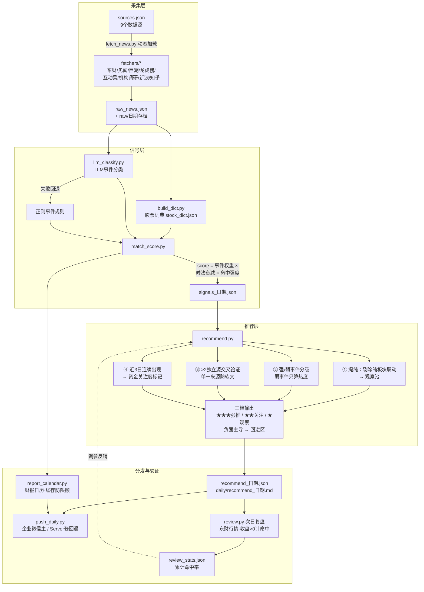

# 股票推荐流程图（pipeline 全链路）

> 依据 run.sh + 各脚本源码整理，版本对应 v0.9（2026-09-14）
> 与《概要设计.md》互为补充：本文聚焦每日运行时数据流

## 全链路流程图

## 环节说明

| 环节 | 脚本 | 产出 | 失败策略 |
|---|---|---|---|
| 采集 | fetch_news.py | raw_news.json + raw/存档 | set -e，采集失败整体中断 |
| 词典 | build_dict.py | stock_dict.json | 阻断 |
| LLM 分类 | llm_classify.py | llm_events.json | **回退正则**，不阻断 |
| 打分 | match_score.py | signals_*.json + signal_report.md | 阻断 |
| 推荐 | recommend.py | recommend_*.json + daily md | 不阻断 |
| 推送 | push_daily.py | 企微/Server酱 | 不阻断，日报已落盘 |
| 日历 | report_calendar.py | 财报披露事件推送 | 不阻断，有缓存防限额 |
| 复盘 | review.py | review_stats.json | 不阻断，无昨日推荐时跳过 |

## 已识别的风险点（2026-09-14 审视）

| # | 观察 | 风险等级 | 说明 |
|---|---|---|---|
| 1 | 推荐层读"最新一份" signals 有隐患 | ⚠️ 中 | `load_signals()` 缺省取 output/ 里字典序最新文件——某天采集失败时会拿旧数据生成当日推荐而不报错。建议加"当日文件不存在即退出"守卫 |
| 2 | 复盘口径较粗 | ⚠️ 低 | 按"次日收盘涨幅>0"计命中，高开低走/尾盘拉升会误判；建议记录买入时点基准（开盘 vs 收盘） |
| 3 | LLM 回退正则的双清单维护 | ✅ 注意 | 正则规则与 STRONG_EVENTS 两套清单，加新事件类型需同步改两处（当前已对齐） |
| 4 | 连续性窗口按文件数不按日历 | ✅ 可接受 | 周末缺文件时窗口拉长，影响小 |
| 5 | 推送/日历/复盘均不阻断 | ✅ 设计良好 | 单环节失败不影响主线 |
| 6 | review_stats → 阈值反馈闭环 | ✅ 亮点 | 数据反哺推荐参数，架构正确 |
